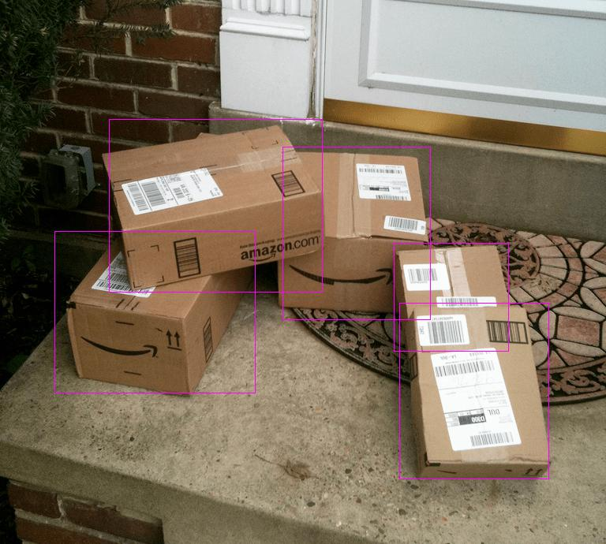
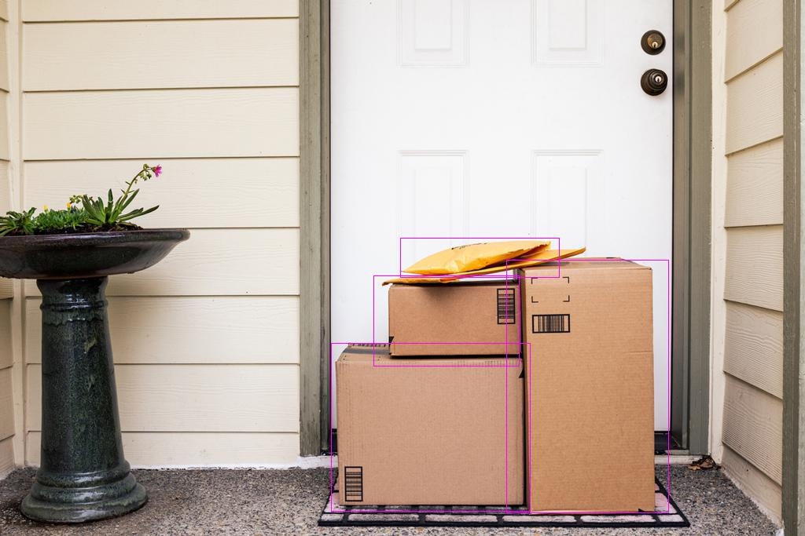
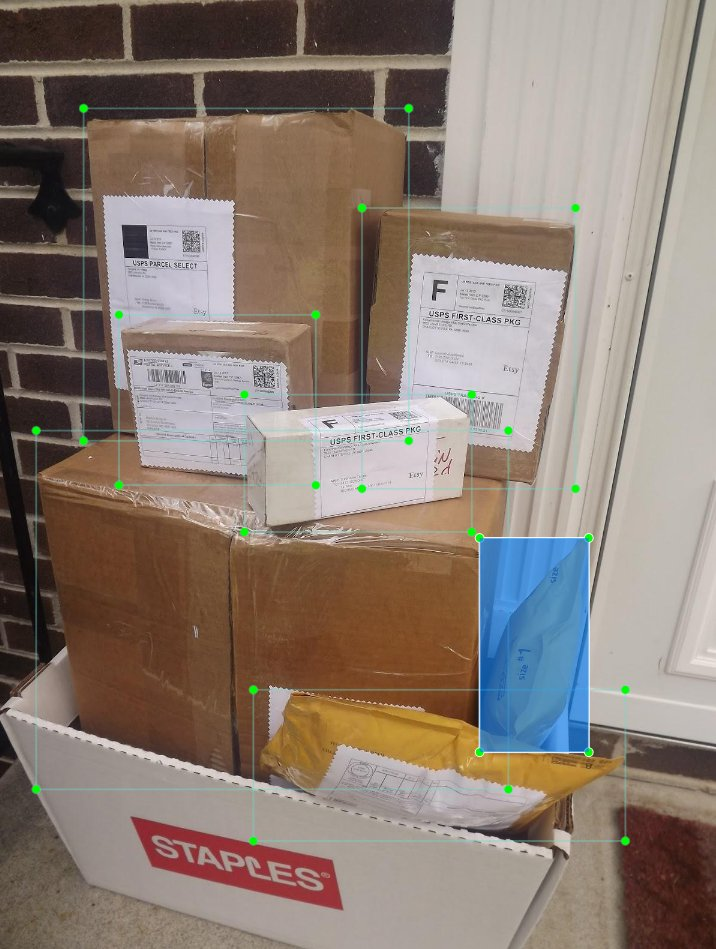
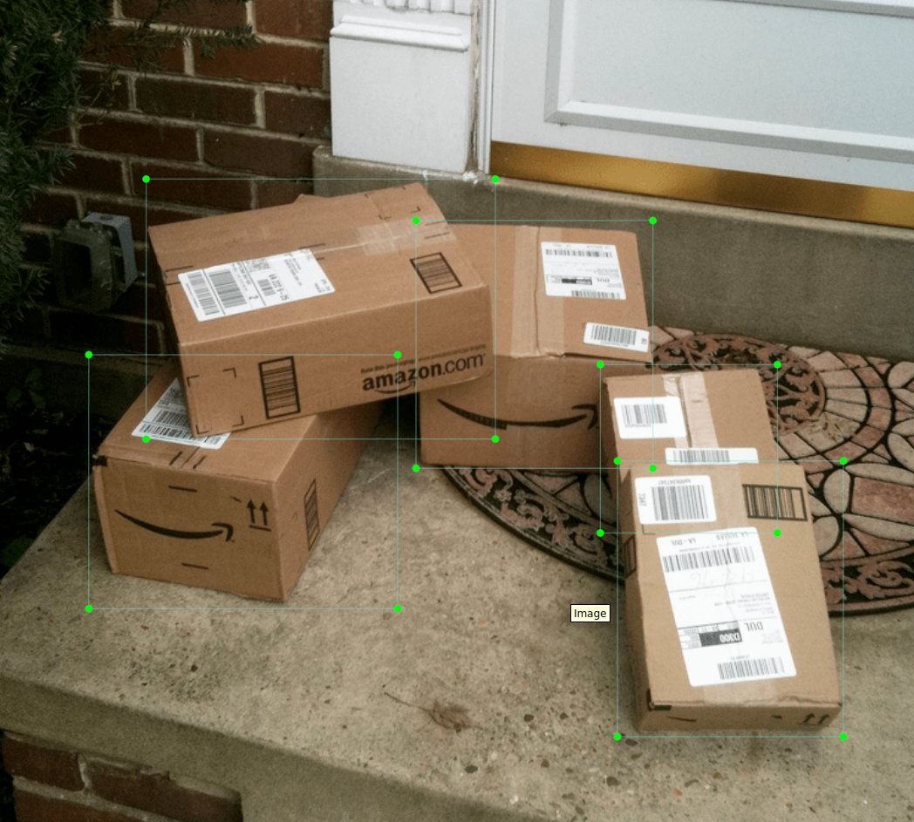

# Package Detection (PyTorch YOLOv4)


[](./License.txt)

Hi, I am Fuyi Yang, a senior student in high school. I'm enjoy using machine learning methods to solve practical problems
in our daily life. This system is developed for package arrival reminder by sending messages to one’s favorite
communication APP and attempting to prevent one’s packages from being stolen, which
happens frequently in the real world.

I searched on the internet and discovered the 
[YOLOv4 PyTorch implementation from Roboflow](https://github.com/roboflow-ai/pytorch-YOLOv4). 
In practice, however, I found certain issues:
1. limited package training dataset (only 95 pictures can be found from Roboflow)
2. complicated conversions between different dataset formats(COCO, YOLOv4, YOLO darknet) :(

To solve the first problem, I used the [web crawler program from 
Google Image Scrapper](https://github.com/ohyicong/Google-Image-Scraper) to collect more package pictures
and interactively labeled these data using [labelImg](https://github.com/qaprosoft/labelImg), increasing the dataset to more than 400 pictures.
For the second issue, I wrote a function ```tools/format_converter.py``` to convert COCO/YOLO formats
to the required input format for YOLOv4 model.

All the data, code, and model are welcome for use.
<!---
- [x] Inference
- [x] Train
    - [x] Mocaic
--->
```
├── README.md
├── dataset.py       dataset
├── demo.py          demo to run pytorch --> tool/darknet2pytorch
├── demo_onnx.py     demo to run the converted onnx model
├── models.py        model for pytorch
├── train.py         train models.py
├── test.py          test model with specific image path
├── test_camera.py   test model real time with camera
├── cfg.py           cfg.py for train
├── cfg              cfg --> darknet2pytorch 
├── checkpoints      store checkpoints
├── data
├── log
├── model          
├── tool
│   ├── web_crawler            program that crawls image from google
│   ├── alert.py               sends a message to email box or SMS
│   ├── format_converter.py    yolo/coco format to input, output to yolo format
│   ├── config.py
│   ├── darknet2onnx.py        tool to convert into onnx --> tool/darknet2pytorch
│   ├── darknet2pytorch.py
│   ├── region_loss.py
│   ├── utils.py
│   └── yolo_layer.py
```


# 0.Pretrained Weights

## 0.1 Darknet
- https://drive.google.com/open?id=1cewMfusmPjYWbrnuJRuKhPMwRe_b9PaT

## 0.2 PyTorch
You can use darknet2pytorch to convert the Darknet model to PyTorch format, or download the converted model from

- yolov4.pth (https://drive.google.com/open?id=1wv_LiFeCRYwtpkqREPeI13-gPELBDwuJ)
- yolov4.conv.137.pth (https://drive.google.com/open?id=1fcbR0bWzYfIEdLJPzOsn4R5mlvR6IQyA)

# 1.Train/Fine-tune

Use YOLOv4 to train/fine-tune the model:

- Download the pretrained weights
- Transform training data to the input format ```x1,y1,x2,y2,id``` and store data paths and ground truths in ```data/train.txt```
    - For YOLO or COCO style datasets, please use ```tool/format_converter.py``` to convert the format
    ```
    # train.txt
    image_path1 x1,y1,x2,y2,id x1,y1,x2,y2,id x1,y1,x2,y2,id ...
    image_path2 x1,y1,x2,y2,id x1,y1,x2,y2,id x1,y1,x2,y2,id ...
    ...
    ...
    ```
- Fine-tune

    Set parameters in ```cfg.py```, then execute train.py to train the model.

# 2.Inference

- Use ```test.py``` or ```test_camera.py``` to make inferences with PyTorch, or use ```demo*.py``` to test the model in
other machine learning frameworks (TensorFlow, Darknet, ONNX).
- Or download my model weight from https://drive.google.com/file/d/1m5bqa16cvrWNfobE7lPCBnKI9qYNoOkz/view?usp=sharing




# 3.Update Model Using New Dataset
- Collect a new dataset and make inferences (step 2)
- Use my new function```tool.format_converter.to_yolo()``` to convert inference results to YOLO format
- Use [labelImg](https://github.com/qaprosoft/labelImg) to adjust and save the labels 
- Repeat steps 1 to 3 for model updating
- 


# 4.Model Convert
- Darknet2ONNX: use ```tool/darknet2onnx.py```

- ONNX2Tensorflow: use ```tool/onnx2tensorflow.py```


# Reference:
- Paper Yolo v4: https://arxiv.org/abs/2004.10934
- Darknet source code: https://github.com/AlexeyAB/darknet
- YOLOv4 PyTorch implementation from Roboflow: https://github.com/roboflow-ai/pytorch-YOLOv4
- Web crawler program from Google Image Scrapper: https://github.com/ohyicong/Google-Image-Scraper
- labelImg: https://github.com/qaprosoft/labelImg

```
@article{yolov4,
  title={YOLOv4: YOLOv4: Optimal Speed and Accuracy of Object Detection},
  author={Alexey Bochkovskiy, Chien-Yao Wang, Hong-Yuan Mark Liao},
  journal = {arXiv},
  year={2020}
}
```